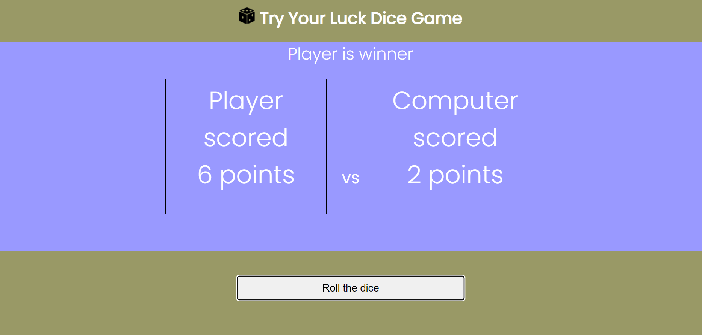
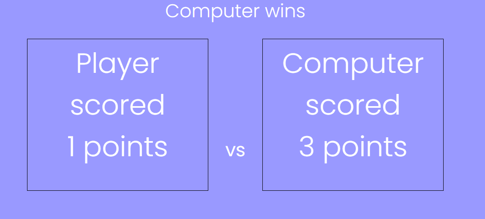

# Try your luck dice game

The Try your luck dice game site is a simple and enjoyable dice game based on luck of the random digital dice. The user competes against the computer and has an equal chance of winning. The site is directed at users who are interested in playing a quick simple game without any preknowledge of complicated game rules. Visitors to this site will benefit from the simplicity and speed of the game.

## Features
### Existing Features
- Heading area
    - The heading text and brand logo at the top of the page serve as the page title and introduction to the site 
    - The top heading area content informs and enables the user to quickly comprehend what the site is all about.
    
- Game area
    - The game area takes up the largest part of the site. This is where the game is played and shown. It consist of the display area where the game result is displayed and areas for the competiting player and computer
    - The simplicity of the text based game area allows the user to be constantly informed and therefore play the game easily.
    
- Game button
    - The game button is used to control the start of a new game. It also triggers the display of the game status and winner. 
    - This button alone allows the user to control all aspects of the game. No other aid or skills are required to play the game.
    